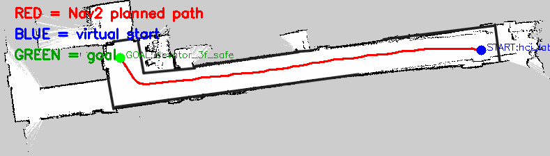

# Unitree Go2 Multi-Floor Voice-Guided Navigation Prototype

[**Open the documentation website**](https://darhan7.github.io/go2-multifloor-guide-nav/)
·
[**阅读中文教程**](https://darhan7.github.io/go2-multifloor-guide-nav/zh/)


This repository grew from a practical question: **how far can a Unitree Go2 EDU be pushed toward a useful indoor guide robot with the hardware and software already available in the lab?**

The project starts at the bottom of the stack—networking, DDS, point clouds, TF, 2D mapping, localization and Nav2—and then adds the application layer needed for a real building: operational floor maps, semantic destinations, robot-safe approach points, a multi-floor graph, an elevator hand-off workflow, route-preview tools, and a voice-intent design.

The documentation is written as **learning through a real engineering workflow**. At each practical step it explains what the underlying ROS 2 or robotics concept is, how the actual archived code calls it, why the design was chosen, how to verify it, and what changes when the scene or robot changes.

中文文档可通过网站页头的语言选择器切换。英文版位于网站根目录，中文版位于 `/zh/`。



## Start here

- **New to ROS 2:** open **System → Learning path**, then follow architecture, ROS 2, TF, networking, mapping, localization, and navigation.
- **Comfortable with code:** start from the network and sensor pipeline; each page explains the messages, APIs, and official components used by the project.
- **Experienced reader:** jump to archived scripts, Nav2 YAML, semantic anchors, planner debugging, and multi-floor task design.

## Clone is not installation

```bash
git clone <repository-url>
cd go2-multifloor-guide-nav
```

Cloning downloads code, maps, configuration, images, and documentation. It does **not** install ROS 2 Foxy, Nav2, CycloneDDS, or Unitree interfaces.

The repository includes:

```text
tools/build_docs.sh                  build the documentation environment
tools/configure_vm_dual_nic.sh       configure the VM's Go2 + Internet adapters
tools/preflight_check.sh             inspect VM or dock readiness
dependencies/                         runtime dependency notes
config/examples/                      editable dock and CycloneDDS examples
```

The archived dock depended on a pre-existing `graph_pid_ws` whose full source provenance was not preserved, so the project deliberately avoids claiming a universal one-command dock installer.


## What the project demonstrates

- Windows + VMware dual networking for simultaneous Go2 LAN and Internet access;
- PointCloud2 → LaserScan → `slam_toolbox` mapping on a Go2 expansion dock;
- operational map boundaries for the relevant guide area;
- ROS 2 Foxy orchestration for map loading, AMCL, Nav2 lifecycle, planning, control, and motion bridging;
- semantic points separating human-facing locations from robot-safe navigation anchors;
- planner-only route validation with CSV and PNG outputs;
- Floor 1 / Floor 3 building-level alignment and a human-assisted elevator transition;
- a modular path from voice intent to semantic navigation.

## Technical foundations and alternative learning routes

The system uses ROS 2 Foxy, CycloneDDS, Unitree ROS messages and APIs, `slam_toolbox`, `robot_localization`, AMCL, and Nav2. Selected Go2-specific packages were adapted where useful; the maps, workflow, semantic layer, multi-floor design, preview tools, and documentation were organized for this project.

For another broad Chinese Go2 learning route, see the [Go2 robot laboratory guide](https://ztl3106742440-hub.github.io/go2-tutorial/). Detailed attribution is recorded in [`THIRD_PARTY_NOTICE.md`](THIRD_PARTY_NOTICE.md) and the documentation's **Technical foundations** page.

## License

Original code and documentation authored specifically for this repository
are released under the MIT License unless otherwise noted.

Third-party projects and referenced implementations remain under their
respective copyrights and licensing terms. This repository links to those
projects rather than relicensing their source code. See
[`THIRD_PARTY_NOTICE.md`](THIRD_PARTY_NOTICE.md).

Maps, photographs, screenshots and externally authored assets are included
for project documentation and are not separately relicensed unless explicitly
stated.
