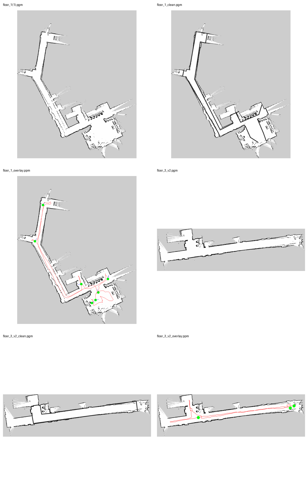

# Unitree Go2 Multi-Floor Voice-Guided Navigation Prototype

This project began with a practical question: **could the Unitree Go2 EDU already available in the lab be developed, step by step, into a robot that understands a real building, reaches useful presentation points, and provides a solid foundation for multi-floor voice guidance?**

The work did not come from running one repository unchanged. It grew from the lower layers—networking, DDS, point clouds, TF, 2D mapping, localization and Nav2—and then added the application layer that an indoor guide robot actually needs: operational maps, semantic destinations, robot-safe anchors, floor relationships, an elevator hand-off workflow and a voice-intent interface.

This site is both a project showcase and a tutorial that tries hard not to skip the steps people usually have to rediscover on their own.

!!! tip "New to ROS 2?"
    Begin with the [learning path](system/learning-path.md). Each practical page explains the concept, real code, verification method, and official component at the point where it is used.

!!! info "Cloning is not installing the robot runtime"
    The repository downloads code, maps, and documentation. ROS 2 Foxy, CycloneDDS, Unitree interfaces, and dock dependencies are prepared layer by layer in [environment setup](system/environment.md).

<figure class="hero-figure" markdown="span">
  
  <figcaption>Floor 3 planner validation: after separating the visitor-facing point from the robot-safe start anchor, Nav2 produced a complete corridor route.</figcaption>
</figure>

## The engineering journey

-   **Make networking boring first**

    ---

    A VMware bridged adapter reaches the Go2 LAN while a second NAT adapter keeps normal Internet access available.

-   **Turn 3D LiDAR data into a 2D map**

    ---

    Go2 PointCloud2 data passes through TF, point-cloud accumulation and height filtering before reaching `slam_toolbox` as `/scan`.

-   **Define the area the demonstration actually needs**

    ---

    Instead of walking the robot through an entire building simply to close every map boundary, the occupancy map is prepared around the intended operating region.

-   **Separate what visitors see from where the robot should stop**

    ---

    Human-facing POIs and robot-safe navigation anchors are represented separately, which also resolves planning failures near inflated obstacles.

-   **Connect two floors into one building-level model**

    ---

    A shared elevator-door structure aligns the floor maps, while a building graph and human-assisted elevator workflow connect the tasks.

-   **Leave a clean interface for voice guidance**

    ---

    Speech produces an intent; the semantic layer resolves the floor and safe anchor; Nav2 handles movement.

## Project at a glance

<figure markdown="span">
  
  <figcaption>Go2 LAN over the bridged adapter; Internet default route over NAT.</figcaption>
</figure>

<figure markdown="span">
  
  <figcaption>Raw maps, operational maps and recorded acquisition trajectories.</figcaption>
</figure>

<figure markdown="span">
  
  <figcaption>Building-level correspondence through the shared elevator landmark.</figcaption>
</figure>

## Choose your starting point

With only a computer, you can inspect the maps, scripts, configurations and route results. With an equivalent ROS 2 Foxy/Nav2 environment, you can reproduce the planner-only workflow. When the Go2 and expansion dock are available again, the real-robot chapter reconnects AMCL, the controller and the motion bridge.

The on-site phase completed mapping, the low-level motion path and Floor 3 global-planner validation. Leaving the laboratory placed elevator switching, Floor 1 semantic calibration and the final speech-to-navigation loop into a well-defined next phase rather than an invented result—making the project easier for another researcher to continue.
