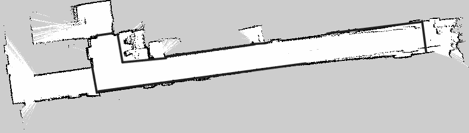

# Defining the operational map boundary

## Current task

Prepare the SLAM occupancy grid as a static working map for the demonstration. The goal is not to reconstruct the entire building; it is to define where the robot is allowed to plan within the relevant corridors, lobby, elevator approach, and guide locations.

## Why the entire building did not need to be mapped

A naturally closed occupancy map would require driving through large areas unrelated to the demonstration. Instead, the project collected the target region carefully and added conservative occupied boundaries with ordinary raster editing based on known physical structure.

This is a navigation fence, not generative completion and not invented free space.

## What PGM values mean

Dark pixels are normally interpreted as occupied, light pixels as free, and intermediate values according to `occupied_thresh`, `free_thresh`, and `negate`. Editing must preserve image dimensions and grayscale semantics because YAML resolution and origin still refer to the original pixel grid.

## Floor 1

| Collected map | Operational map |
|:---:|:---:|
|  |  |

## Floor 3

| Second-pass collection | Operational map |
|:---:|:---:|
|  |  |

The first Floor 3 pass was exploratory. The second pass became the basis for cleanup, semantic anchors, and planning. The historical word `recover` does not mean recovery from a corrupted file or bag.

## Why a PGM edit affects Nav2

```text
PGM + YAML
→ map_server
→ /map OccupancyGrid
→ global costmap static layer
→ inflation layer
→ planner traversability
```

The planner sees cell costs, not visual aesthetics. An occupied boundary enters the static layer and creates inflated costs around it.

## Editing rules

- follow known physical or operational boundaries;
- prefer conservative occupied cells over unverified free space;
- preserve both raw and working maps;
- do not change dimensions, resolution, or origin;
- reload and inspect the costmap after editing;
- validate on the robot at low speed in a controlled area.

More advanced systems may use keepout filters or polygonal forbidden zones. Direct raster editing was transparent and practical for this Foxy prototype.
