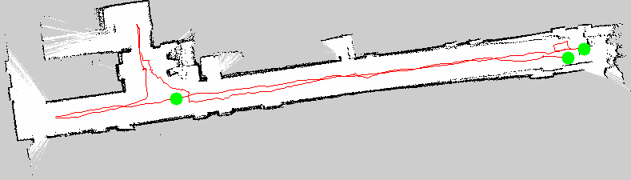

# Mapping trajectory and stop candidates

## Task and learning goals

This stage records global robot poses to CSV and groups consecutive samples into candidate dwell segments. It is not route planning; it extracts possible guide locations from the real collection process.

The red lines are the robot's recorded acquisition trajectory, not Nav2 plans. Green circles are candidate stationary segments.

| Floor 1 trajectory | Floor 3 trajectory |
|:---:|:---:|
|  |  |

`map_pose_logger.py` records the live TF pose once per second:

```python
tf = self.buffer.lookup_transform("map", "base_footprint", rclpy.time.Time())
x = tf.transform.translation.x
y = tf.transform.translation.y
yaw = quat_to_yaw(tf.transform.rotation)
self.writer.writerow([t, x, y, yaw])
```

`find_stop_segments.py` classifies adjacent samples:

```python
dist = math.hypot(b["x"] - a["x"], b["y"] - a["y"])
dyaw = abs(angle_diff(b["yaw"], a["yaw"]))
stopped = dist < dist_thresh and dyaw < yaw_thresh
```

The overlay converts world coordinates to pixels using map resolution and origin:

```python
px = int((x - origin_x) / resolution)
py = int(height - 1 - (y - origin_y) / resolution)
```

The vertical flip is required because map y increases upward while image rows increase downward. Candidate generation is intentionally broad; semantic points are still selected by a person based on presentation value and navigation safety.

## Why log TF instead of integrating `/cmd_vel`

`/cmd_vel` is desired velocity, not measured displacement. Gait, slip, and low-level limits create differences. Logging `map → base_footprint` uses the global pose estimated by mapping or localization.

A dwell detector should merge consecutive low-motion samples and then test duration; one small step alone does not prove a stop. Yaw is circular and should be averaged through sine and cosine rather than ordinary arithmetic.

Candidate stops still require human checks for semantic value, free-space safety, useful orientation, and corridor or elevator obstruction.
