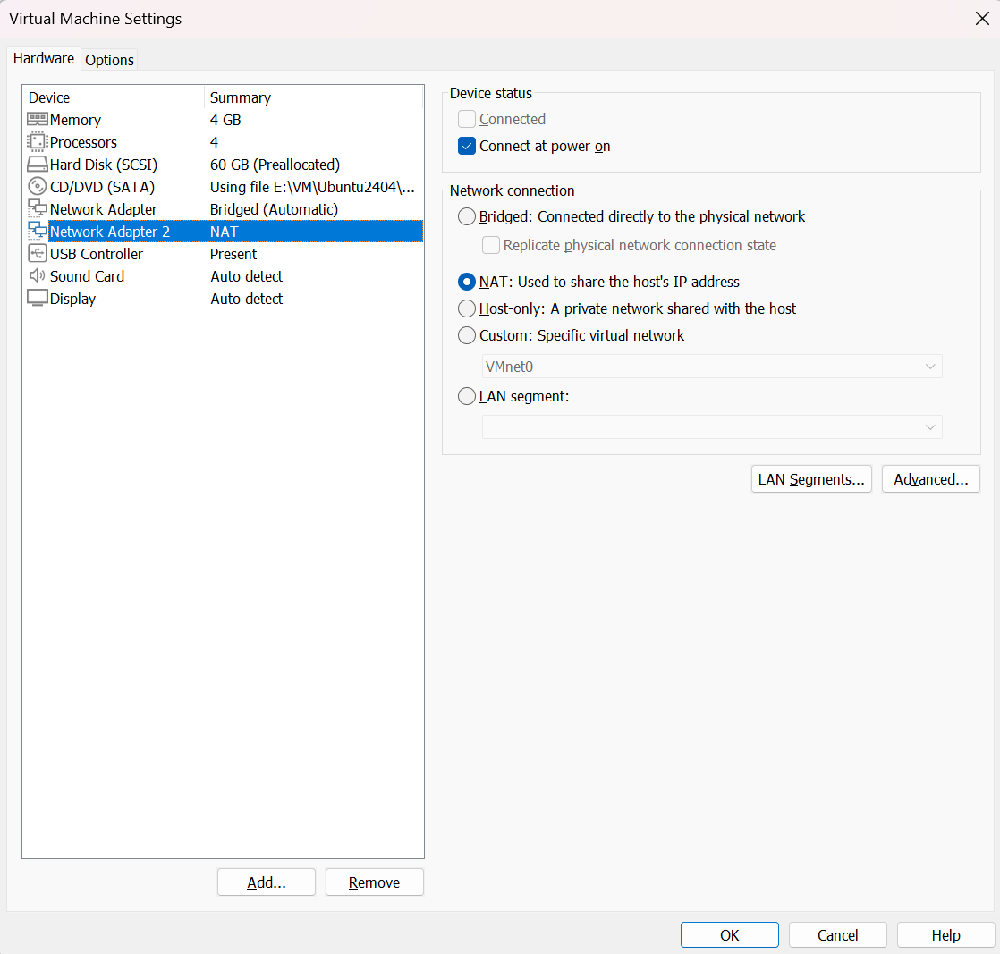
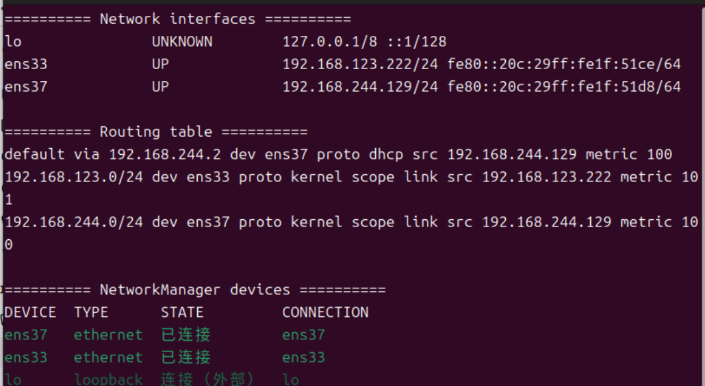

# VMware dual NIC from scratch: Go2 LAN and Internet together

## Current task

The VM must reach both the Go2/dock network at `192.168.123.0/24` and the Internet. A single adapter often makes those goals compete, so the design uses one bridged adapter and one NAT adapter with explicit routing roles.

## Concepts first

### Interfaces, addresses, and subnets

VMware creates virtual NICs; Ubuntu exposes them as interfaces such as `ens33` and `ens37`. In `192.168.123.222/24`, `/24` corresponds to `255.255.255.0`, placing the interface in the same local subnet as the Go2 and dock.

### Gateway and default route

A gateway is the next hop to other networks. The default route is used only when no more specific route matches. Linux prefers:

```text
192.168.123.0/24 dev ens33
```

over:

```text
default via 192.168.244.2 dev ens37
```

for Go2 traffic. Internet traffic uses the NAT default route.

### DNS

DNS translates names to addresses. Reaching `8.8.8.8` but not a domain points to DNS; resolving domains but failing to reach Go2 points to the device subnet or route.

### Bridged versus NAT

- **Bridged** places the VM directly on the selected physical network;
- **NAT** shares the host's Internet connection through VMware's virtual router.

## Add the second adapter

Power the VM off completely, open **Edit virtual machine settings**, select **Add... → Network Adapter → Finish**, and enable **Connected** and **Connect at power on** for both adapters.

## Configure the bridged adapter


Bridge to the physical interface actually connected to Go2. Automatic selection can be wrong when Wi-Fi, USB Ethernet, and wired adapters coexist.

## Configure the NAT adapter



NAT normally obtains an address, gateway, and DNS using DHCP on VMware's VMnet8 network.

## Identify Ubuntu interfaces

```bash
ip -br link
nmcli device status
```

The project used `ens33` for the Go2 LAN and `ens37` for NAT, but interface names are not universal.

## Configure persistent NetworkManager profiles

```bash
sudo ./tools/configure_vm_dual_nic.sh ens33 ens37
```

The Go2 profile uses a static address, no gateway, and `ipv4.never-default yes`. The NAT profile uses DHCP and may provide the default route. The important design is not the exact address: it is preventing the device LAN from becoming the general Internet route.

`nmcli device` shows current hardware state; `nmcli connection` manages saved profiles. A profile must be brought up after modification for it to affect the interface.

## Verify the result

```bash
ip -br addr
ip route
nmcli device status
```



Expect a specific route for `192.168.123.0/24` and a default route through the NAT interface.

## Transferable design

The same pattern applies to cameras, robot arms, or other private device networks: change interface names and subnets, but keep the device interface free of a default gateway while the Internet interface owns the default route.

## References

- [Official Unitree ROS 2 networking instructions](https://github.com/unitreerobotics/unitree_ros2)
- [Alternative Go2 environment guide](https://ztl3106742440-hub.github.io/go2-tutorial/01-foundation/01-install/)
- [Next: verify and recover](verify-recover.md)
