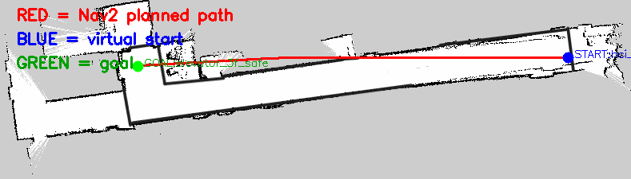

# Planning debug story: from “a line exists” to a trustworthy path

The three images show an important robotics principle: output that looks like a path does not prove that the planning chain is correct.

## 1. Straight line before verification



This result was generated before the planner, lifecycle state, and costmap had been fully verified. It crosses structure and should be labelled an untrusted preview, not “Nav2 produced a bad path.” Possible causes include the wrong action server, parameters under another node name, an inactive or empty costmap, or invalid visualization data.

## 2. No path after the costmap became effective


With static and inflation layers active, the original start lay near occupied or inflated cells and the planner returned zero poses. The system had become more honest: visual free space is not necessarily traversable costmap space.

## 3. Valid path after moving to a safe anchor


Separating the human viewing location from a robot-safe navigation anchor moved the start into corridor free space and produced a multi-pose path. The correct fix was in the application anchor, not weakening collision costs.

## Reusable diagnostic order

```text
verify action server and node name
→ verify lifecycle active
→ verify /map reached the global costmap
→ verify start and goal are safe
→ inspect planner plugin and parameters
→ inspect visualization and output files
```
