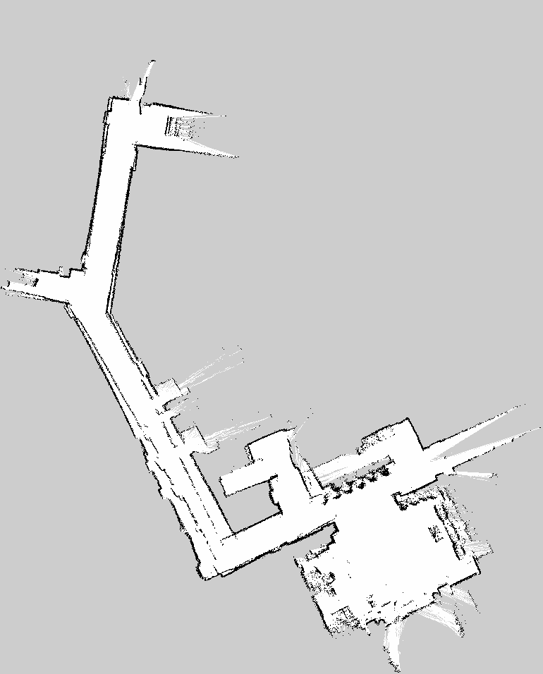
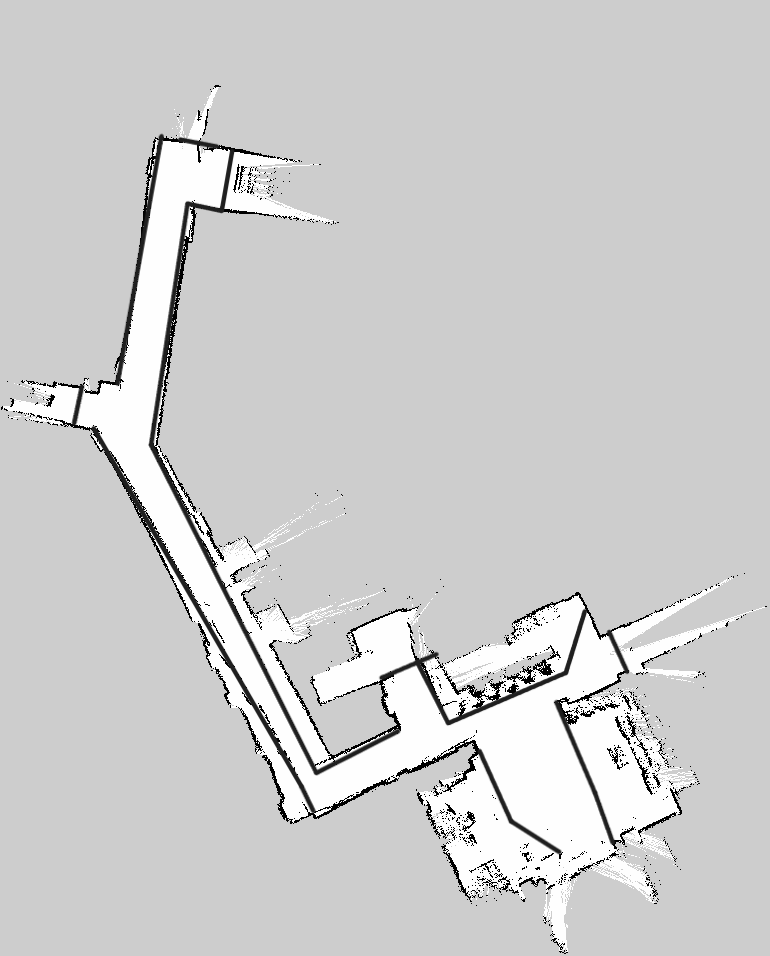
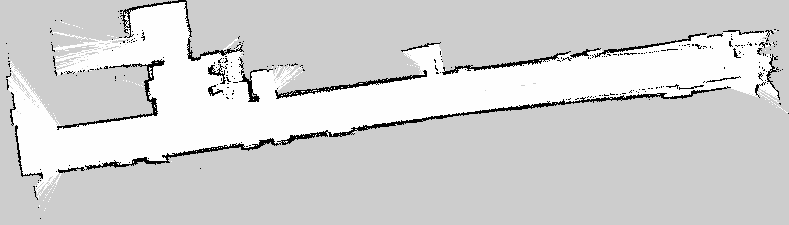

# 为导览任务划定地图工作区域

## 当前任务

把 SLAM 生成的栅格图整理成适合本次导览任务的静态工作地图。这里不是追求“完整复刻整栋楼”，而是明确：机器狗在本次演示中允许在哪些走廊、大厅、电梯口和讲解区域内规划。

## 为什么不必为了封闭地图跑完整栋楼

Occupancy map 只会根据传感器真正观察到的区域建立边界。如果希望所有外侧边界都由实际点云自然封闭，往往需要沿整栋楼的外围和大量无关区域行走。这会显著增加采集时间，却不会提升本项目目标路线的价值。

因此采用更工程化的办法：

1. 对目标区域进行足够认真地采集；
2. 保留真实观测到的走廊和墙体结构；
3. 根据现场已知边界，用普通画笔在 PGM 中补充**保守的占据边界**；
4. 让 Nav2 只在明确的工作区域中规划。

这类似为静态地图加入导航围栏。它不是生成式补图，也不是把未经验证的区域画成自由空间。

## PGM 中的颜色意味着什么

在常见 `map_server` 配置下：

- 深色像素倾向于被解释为 occupied；
- 浅色像素倾向于被解释为 free；
- 中间灰度根据 `occupied_thresh`、`free_thresh` 和 `negate` 处理为未知或占据概率。

编辑时必须保持图像模式和尺寸，不要无意中缩放、压缩或改变灰度映射。YAML 的 `resolution` 和 `origin` 仍对应原始像素网格。

## 一楼：采集图与工作地图

| 采集地图 | 导航工作地图 |
|:---:|:---:|
|  |  |

## 三楼：第二次正式采集与工作地图

| 第二次采集 | 导航工作地图 |
|:---:|:---:|
|  |  |

三楼第一版只是验证流程的试采；第二版才是后续整理、语义点和路径规划的基础。历史名称中的 `recover` 不表示从损坏文件或 rosbag 恢复。

## 为什么修改 PGM 会改变 Nav2

加载链路是：

```text
PGM + YAML
→ nav2_map_server
→ /map OccupancyGrid
→ global_costmap static_layer
→ inflation_layer
→ planner 可通行区域
```

一条画入的占据边界会进入 static layer，随后在其周围形成膨胀代价。规划器看到的不是“图片好不好看”，而是每个格子的通行代价。

## 编辑原则

- 只沿真实、已知的建筑边界或任务边界补充障碍；
- 优先增加保守障碍，不新增未经确认的自由空间；
- 保留原始图与工作图，便于追溯；
- 不改变尺寸、resolution 和 origin；
- 编辑后重新加载地图并检查 costmap，而不是只看 PNG；
- 最终实机运行仍需低速和人工安全验证。

## 如何验证编辑没有破坏地图

```bash
ros2 run nav2_map_server map_server \
  --ros-args \
  -p yaml_filename:=/absolute/path/floor_3.yaml
```

检查：

```bash
ros2 topic echo --once /map --field info
ros2 topic echo --once /map --field data
```

再运行 planner-only 预览，确认目标区域可达、边界外不可达、墙体附近路径留有合理距离。

## 可以迁移的思想

不同项目可以使用 keepout filter、禁行多边形或语义地图实现更高级的工作区域约束。本项目选择直接编辑静态栅格，是因为 Foxy 环境、时间条件和演示需求下，它简单、透明且容易审计。
