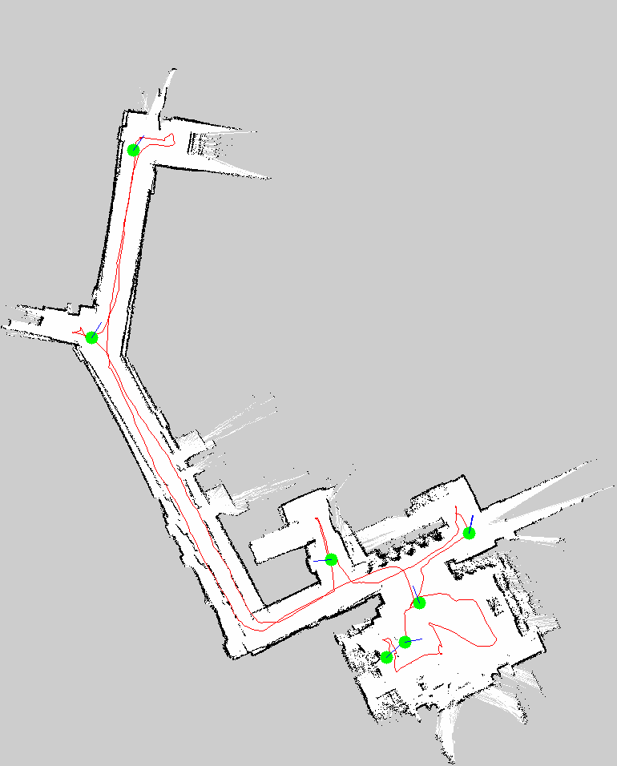

# 采集轨迹与停留点：从 TF 记录到地图叠加

## 当前任务与知识目标

这一步把机器人在地图坐标系中的历史位姿保存为 CSV，再从连续样本中找出“在附近停留了一段时间”的候选段。它不是导航规划，而是从实际采集过程提取可能的讲解位置。

红线不是 Nav2 规划路线，而是采集过程中机器狗实际走过的轨迹；绿色点来自“在相近位置停留了一段时间”的自动候选。最终是否把某个候选定义为讲解点，仍由人根据展示内容和导航安全性决定。

| 一楼采集轨迹 | 三楼采集轨迹 |
|:---:|:---:|
|  |  |

## 1. 每秒记录一次 `map → base_footprint`

`map_pose_logger.py` 使用 TF buffer 查询机器人在地图中的位姿：

```python
tf = self.buffer.lookup_transform(
    "map",
    "base_footprint",
    rclpy.time.Time(),
)

x = tf.transform.translation.x
y = tf.transform.translation.y
yaw = quat_to_yaw(tf.transform.rotation)

self.writer.writerow([t, x, y, yaw])
```

这里记录的不是轮子/腿部原始里程计，而是已经进入 `map` 坐标系的结果，因此可以直接叠加到 occupancy map 上。

## 2. 如何判断“基本停住”

`find_stop_segments.py` 比较相邻采样：

```python
dist = math.hypot(b["x"] - a["x"], b["y"] - a["y"])
dyaw = abs(angle_diff(b["yaw"], a["yaw"]))

stopped = dist < dist_thresh and dyaw < yaw_thresh
```

当连续样本的位移和转角都低于阈值，就合并成一个停留段。实际代码中的默认阈值是：

```python
dist_thresh = 0.03
yaw_thresh = 0.03
min_duration = 3.0
```

`3 s` 是脚本内部用于生成候选的最低阈值；你在现场筛选展示点时关注的是更长、约二十秒量级的停留。两者并不冲突：程序先宽松地找候选，人再结合现场意义筛选。

## 3. 世界坐标如何变成图片像素

`overlay_stops_on_map.py` 使用地图 YAML 中的 `resolution` 和 `origin`：

```python
px = int((x - origin_x) / resolution)
py = int(height - 1 - (y - origin_y) / resolution)
```

第二行要做 `height - 1 - ...`，是因为地图坐标的 y 轴向上，而图像数组的行号向下。

## 4. 叠加图如何画出来

轨迹点被逐段连成红线，停留段平均位置画成绿色圆：

```python
for a, b in zip(points[:-1], points[1:]):
    draw_line(rgb, width, height, a[0], a[1], b[0], b[1], (255, 0, 0))

for stop in stops:
    px, py = map_to_pixel(stop["x"], stop["y"], resolution, origin, height)
    draw_circle(rgb, width, height, px, py, 8, (0, 255, 0))
```

这套方法也可以用于显示手工标注点、定位漂移记录或 planner 输出；变化的只是输入坐标来自哪里。

## 为什么记录 TF，而不是积分 `/cmd_vel`

`/cmd_vel` 表示期望速度，不等于机器人真实执行的位移；打滑、步态和底层限制都会造成差异。记录 `map → base_footprint` 可以直接使用定位/建图系统估计的全局位姿。

## 停留检测为什么需要时间窗口

单个相邻样本距离很小，可能只是采样频率高，并不代表真正停留。更稳妥的算法会把连续满足位移和转角阈值的样本合并为 segment，再检查 segment 的持续时间。项目中的“约二十秒”是人工筛选候选讲解点的经验尺度，不是通用算法常数。

## yaw 为什么不能普通平均

`179°` 和 `-179°` 的普通平均是 `0°`，但真实方向接近 `180°`。角度统计应使用：

```text
mean_yaw = atan2(mean(sin(yaw)), mean(cos(yaw)))
```

这也是机器人代码中经常将姿态保存为四元数或用正余弦处理环形变量的原因。

## 这些候选点怎样进入应用层

停留点只是数据提示，最终 semantic anchor 还需要检查：

- 是否具有讲解意义；
- 是否位于 costmap 的安全自由区域；
- 机器狗朝向是否适合面对参观者或展品；
- 是否会阻塞电梯或通道。

算法发现候选，人做语义和安全判断，两者职责不同。
