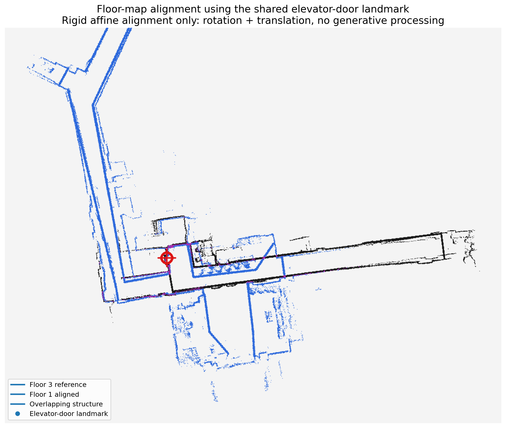
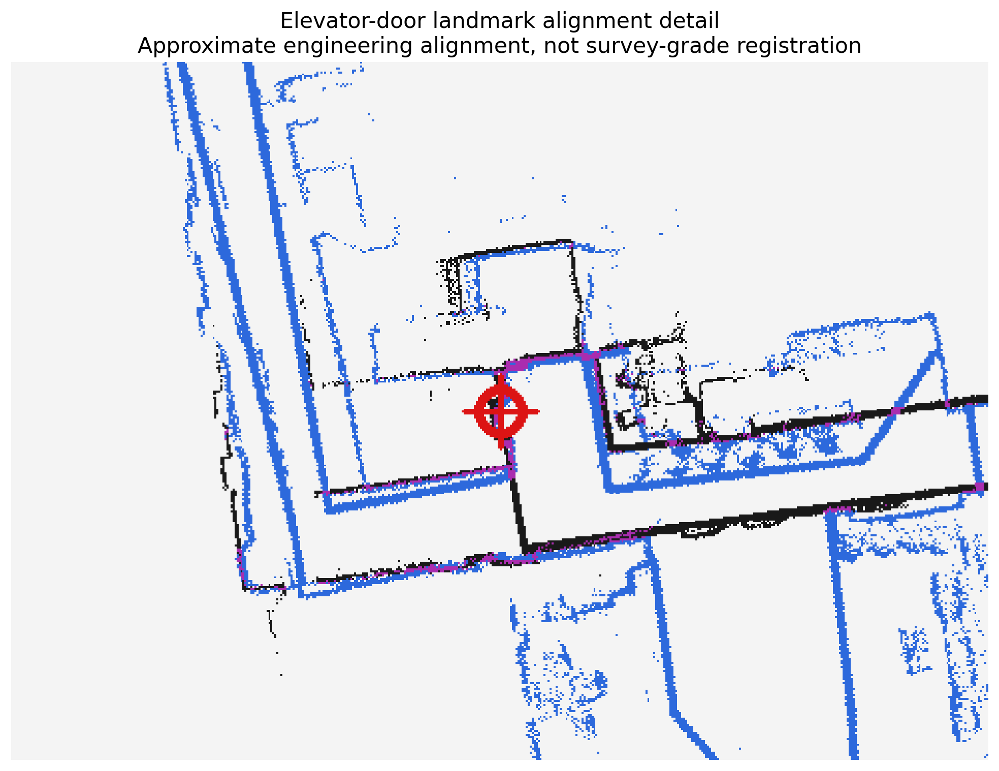
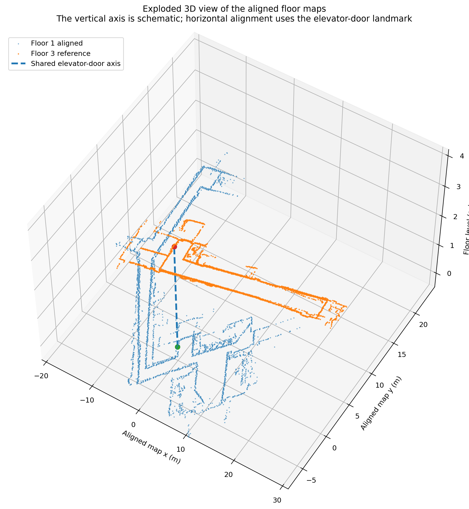

# 楼层地图对齐：建立建筑级对应关系

## 当前任务

一楼和三楼分别在自己的 SLAM 坐标系中建图，原点和朝向互不相同。为了展示两层在建筑中的相对关系，使用两张图都能识别的电梯门凹陷作为共同地标，对一楼地图进行普通几何变换。



## 坐标变换是什么

二维刚体变换包含：

```text
旋转 R
+ 平移 t
```

一个点的转换可写成：

```text
p_target = R · p_source + t
```

本次保持比例 `scale=1.0`，估计一楼相对三楼需要约顺时针 `16.5°` 旋转，再平移到共同电梯位置。计算使用普通仿射/刚体图像变换，没有使用生成式方法。

## 为什么一个地标还不足以做测量级标定

一个对应点可以确定平移，但不能单独确定旋转和尺度。这里的旋转还参考了电梯附近走廊方向，并假设两张 occupancy map 使用相同分辨率。因此结果适合：

- 建筑层展示；
- 理解电梯上下对应；
- 设计 building graph；

不适合声称获得了测量级三维建筑坐标。



## 为什么不直接改写 Nav2 地图原点

每层的 AMCL、语义点和路径都已经建立在本层原生 map frame 中。强行把两个 PGM 改到同一个巨型坐标系，会破坏已有坐标并增加无关空白区域。

更合理的结构是：

```text
floor_1/map   保留本层导航坐标
floor_3/map   保留本层导航坐标
building transform / graph 只描述楼层关系
```

## 三维分层图怎样理解



图中的竖直间隔是展示用的示意高度，不是实测楼层高。竖线表示共同电梯地标的拓扑对应。

## 若以后需要更精确

增加第二、第三个可靠对应点，使用最小二乘估计旋转、平移甚至尺度，并报告残差。也可以测量建筑 CAD 控制点。关键是区分“可视化对齐”和“导航标定”。
