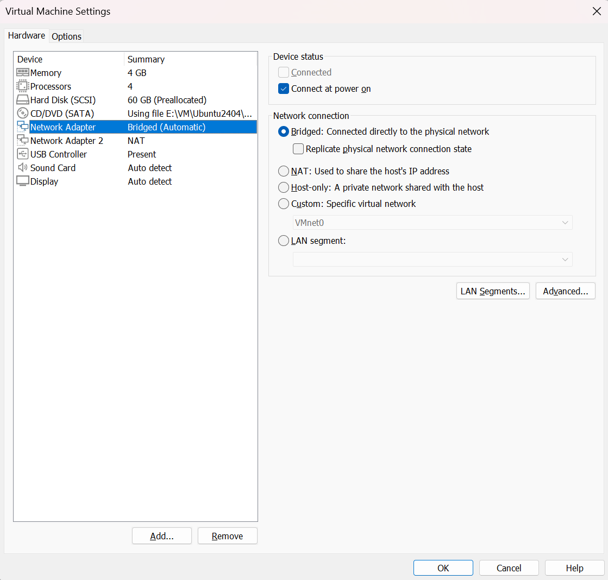

# 从零配置 VMware 双网卡：同时连接 Go2 与互联网

## 当前任务

虚拟机需要同时满足：

```text
访问 Go2 / 拓展坞的 192.168.123.0/24 局域网
+ 正常访问 GitHub、软件源和文档网站
```

单网卡经常只能二选一。这里使用一张桥接网卡和一张 NAT 网卡，并通过路由规则让它们各司其职。

## 先把网络概念讲清楚

### 网卡与网络接口

VMware 创建的是虚拟网卡；Ubuntu 会把它们显示为 `ens33`、`ens37` 等网络接口。接口名只是系统标识，不代表它天然就是桥接或 NAT，真正的连接方式由 VMware 配置决定。

### IP 地址与子网

`192.168.123.222/24` 中：

- `192.168.123.222` 是这张接口的地址；
- `/24` 等价于掩码 `255.255.255.0`；
- 同一子网通常是 `192.168.123.0` 到 `192.168.123.255`；
- Go2 和拓展坞位于这个设备局域网，因此可以直接通信，不需要互联网路由器。

### 网关与默认路由

网关是把数据送往“其他网络”的下一跳。默认路由是没有更具体规则时采用的出口。

Linux 选择路由时优先匹配更具体的网段：

```text
192.168.123.0/24 dev ens33
```

会优先于：

```text
default via 192.168.244.2 dev ens37
```

因此访问 Go2 走桥接网卡，访问互联网走 NAT。

### DNS

DNS 只负责把域名转换为 IP。能 `ping 8.8.8.8` 却打不开域名，通常是 DNS 问题；能解析域名却连不上 Go2，则应检查设备网段和路由。

### Bridged 与 NAT

- **Bridged**：虚拟机像一台直接连接到物理网络的独立电脑；适合进入 Go2 局域网；
- **NAT**：虚拟机通过 VMware 的虚拟路由器共享宿主机互联网；适合软件安装和网页访问。

## 第一步：在 VMware 中添加第二张网卡

完整关闭虚拟机，不要只挂起：

1. 选中 Ubuntu 虚拟机；
2. 打开 **Edit virtual machine settings**；
3. 点击左下角 **Add...**；
4. 选择 **Network Adapter**；
5. 点击 **Finish**；
6. 确认两张网卡都勾选 **Connected** 与 **Connect at power on**。

## 第二步：设置桥接网卡



桥接到真正连接 Go2 的物理接口。电脑同时有 Wi-Fi、USB 网卡和有线网卡时，`Automatic` 不一定总能选择正确接口；通信失败时应回到 VMware 的 Virtual Network Editor 检查桥接对象。

## 第三步：设置 NAT 网卡


NAT 网卡通常通过 DHCP 自动取得 `192.168.244.x` 一类地址、默认网关和 DNS。具体网段由 VMware 的 VMnet8 配置决定，不必与本项目完全相同。

## 第四步：识别 Ubuntu 中的接口

```bash
ip -br link
nmcli device status
```

本项目中：

```text
ens33 → Bridged / Go2 LAN
ens37 → NAT / Internet
```

判断时不要只靠接口编号。可以先查看 NAT 接口是否自动获得地址和默认路由，再确定另一张是设备局域网接口。

## 第五步：配置 NetworkManager profile

仓库脚本：

```bash
sudo ./tools/configure_vm_dual_nic.sh ens33 ens37
```

Go2 接口的核心配置：

```bash
nmcli connection modify "$GO2_CONN" \
  ipv4.method manual \
  ipv4.addresses "192.168.123.222/24" \
  ipv4.gateway "" \
  ipv4.dns "" \
  ipv4.never-default yes \
  connection.autoconnect yes
```

这里最关键的不是静态地址本身，而是：

- 不配置网关；
- `never-default yes`；
- 自动连接。

这样设备网卡只负责 `192.168.123.0/24`，不会抢走互联网默认路由。

NAT 接口：

```bash
nmcli connection modify "$NAT_CONN" \
  ipv4.method auto \
  ipv4.never-default no \
  connection.autoconnect yes
```

`auto` 让 DHCP 提供地址、网关和通常的 DNS。手工 DNS 只在实际解析不稳定时添加，不是所有环境都必须写死。

## `nmcli connection` 与 `nmcli device` 有什么区别

- **device** 表示当前网卡和连接状态；
- **connection** 表示保存在 NetworkManager 中的配置档案；
- 一个 device 可以在不同时间使用不同 connection profile；
- 修改 profile 后，需要重新激活连接，配置才会作用到接口。

脚本最后执行类似：

```bash
nmcli connection up "$GO2_CONN"
nmcli connection up "$NAT_CONN"
```

## 第六步：确认结果

```bash
ip -br addr
ip route
nmcli device status
```


应当看到：

```text
ens33  192.168.123.222/24
default via 192.168.244.2 dev ens37
192.168.123.0/24 dev ens33
```

## 为什么这种设计可以迁移

任何“专用硬件局域网 + 互联网出口”的环境都可以使用相同原则，例如相机、工业机械臂或另一台机器人。需要替换的是接口名、设备网段和静态地址；不变的是**专用网卡不承担默认路由，互联网网卡承担默认出口**。

## 官方与补充资料

- [Unitree ROS 2 网络配置说明](https://github.com/unitreerobotics/unitree_ros2)
- [Go2 机器狗实验指导书：环境搭建](https://ztl3106742440-hub.github.io/go2-tutorial/01-foundation/01-install/)
- [下一页：验证与恢复](verify-recover.md)
