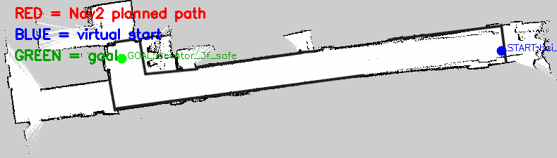

# 路径规划调试案例：从“有一条线”到“可信的路径”

这组三张图的价值不只是展示结果，而是说明机器人调试中一个重要原则：**输出看起来像路径，不代表规划链已经正确。**

## 1. 未验证环境中的穿墙直线


这张图形成于 planner、lifecycle 和 costmap 尚未被完整验证的阶段。它几乎直接连接起终点并穿过结构，因此只能称为“不可信预览”，不能写成 Nav2 正确规划出了一条错误路径。

可能涉及的层包括：

- 实际 action server 与预期节点不是同一个；
- 参数没有加载到正确节点名；
- costmap 尚未 active 或没有静态地图；
- 可视化脚本只连了端点或读取了无效结果。

正确做法不是立即调 planner 参数，而是先证明：

```bash
ros2 lifecycle get /planner_server
ros2 topic echo --once /global_costmap/costmap
ros2 action info /compute_path_to_pose
```

## 2. Costmap 生效后返回空路径



当静态层和膨胀层真正进入规划后，原始起点位于墙体/膨胀代价附近，planner 返回 `poses=0`。这不是“系统变差了”，而是代价地图开始正确拒绝不安全输入。

地图中的白色区域与 costmap 中可通行区域不同：机器人半径、inflation 和未知区域策略都会缩小安全空间。

## 3. 调整机器人安全点后获得有效路线


将人类观看位置与机器人导航位置分开，把起点移动到走廊中的安全自由空间后，Navfn 生成了沿走廊弯曲的多点路径。

这一变化说明应该修改的是应用层 anchor，而不是强行降低障碍代价让机器人贴墙。

## 一套可复用的诊断顺序

```text
确认 action server 和节点名
→ 确认 lifecycle=active
→ 确认 /map 进入 global costmap
→ 检查起点和目标是否在安全自由区
→ 再检查 planner plugin 和参数
→ 最后检查可视化和输出文件
```

这套顺序比“看到异常就不断改参数”更有效，也更容易保留可解释的调试记录。
